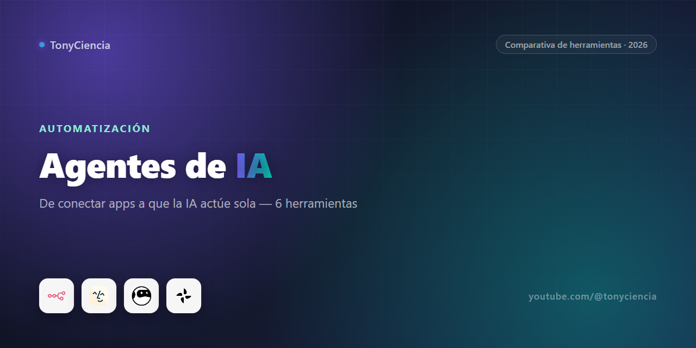

# Agentes de IA y automatización: de conectar dos apps a que la IA actúe sola (2026)

"Automatización" en 2026 significa tres cosas muy distintas, y la mayoría de la gente las mete todas en la misma bolsa. Conectar dos apps para que un formulario dispare un email es un nivel. Que una IA lea una página web y te devuelva los datos ordenados en una hoja de cálculo es otro. Que un agente revise tu bandeja de entrada, decida qué responder y lo mande sin que lo mires es un tercero — y bastante más nuevo. Confundir estos tres niveles es la razón por la que tanta gente prueba una herramienta de automatización, se decepciona porque "no hace lo que pensaba", y en realidad lo que pasó es que estaba buscando algo de otro nivel completamente distinto.

Esta guía separa por nivel, no por nombre de herramienta.

## La comparativa rápida

| | Herramienta | Para qué sirve | Link |
|---|---|---|---|
|  | **n8n** | Automatización de flujos de trabajo, open-source y auto-hosteable | [Probar →](https://n8n.partnerlinks.io/8qtvuqc23ra6) |
|  | **Dry Ground AI** | Automatización de flujos de trabajo con IA, orientada a negocio | [Probar →](https://partners.dryground.ai/vqh9n364qwmn) |
|  | **Browse AI** | Extrae datos de cualquier sitio web sin código | [Probar →](https://partners.browse.ai/xl7l8y680nvi) |
|  | **Lindy** | Agentes de IA personales que actúan en tu email, calendario y apps | [Probar →](https://try.lindy.ai/gkd3o3sgd7d2) |
|  | **Turbotic** | Automatización de procesos robóticos (RPA) a nivel empresa | [Probar →](https://try.turbotic.com/nkdqxpx9guh8) |
|  | **QuillBot** | Parafraseo y corrección de texto con IA | [Probar →](https://try.quillbot.com/k5to8y5zq7gh) |

---

## Automatización de flujos de trabajo: n8n vs. Dry Ground AI

Este es el nivel más conocido — el que popularizó Zapier: "cuando pasa X en una app, hacé Y en otra". **n8n** juega ese juego pero con dos diferencias que importan si tenés algo de perfil técnico: es open-source y lo podés auto-hostear, así que no dependés de los límites de ejecuciones de un plan pago ni de que tus datos pasen por un tercero. El editor visual de nodos es potente pero también asume que estás cómodo pensando en lógica condicional, transformación de datos y APIs — no es el más simple para alguien que nunca automatizó nada.

**Dry Ground AI** apunta a un usuario distinto: alguien de negocio que quiere automatizar un proceso con IA metida adentro del flujo (no solo mover datos entre apps, sino que un paso del flujo lo resuelva un modelo) sin tener que operar infraestructura propia ni pensar en nodos y conexiones al estilo desarrollador. Si tu equipo tiene a alguien técnico dispuesto a mantener el sistema, n8n te da más control y cero costo de licencia por ejecución. Si lo que buscás es que el flujo funcione sin que dependa de esa persona técnica, Dry Ground AI reduce esa fricción a cambio de operar dentro de su plataforma.

## Extracción de datos web sin código: Browse AI

Antes de automatizar algo con datos de una web, primero hay que *sacar* esos datos — y ahí la mayoría termina escribiendo un scraper que se rompe cada vez que el sitio cambia el diseño. **Browse AI** resuelve ese problema puntual: le mostrás visualmente qué datos querés (precios de la competencia, listados, resultados de búsqueda, lo que sea) y arma un robot que los extrae de forma programada, sin que tengas que tocar código ni mantener selectores CSS. Es la pieza que suele faltar antes de un flujo tipo n8n: primero conseguir el dato limpio, después decidir qué hacer con él.

## Agentes personales que actúan por vos: Lindy

Acá el salto de nivel es real. Un flujo de n8n hace lo que le programaste, ni más ni menos. **Lindy** construye agentes de IA que operan con más autonomía dentro de tu email, calendario y apps conectadas: leen contexto, deciden una acción razonable, y la ejecutan — agendar una reunión, filtrar y responder correos rutinarios, resumir lo que pasó en un canal. No es "IA que te ayuda a escribir una respuesta", es IA que puede llegar a mandarla. Eso lo hace más potente y también exige más confianza de tu parte: conviene empezar dándole tareas de bajo riesgo y ir soltando control a medida que ves cómo se comporta.

## Automatización a nivel empresa: Turbotic

**Turbotic** vive en una categoría distinta a todo lo anterior — RPA (automatización robótica de procesos) pensada para operaciones grandes, no para un flujo individual armado por una persona. Acá el problema típico es: una empresa tiene decenas o cientos de bots de RPA corriendo procesos internos (facturación, conciliación, migración de datos entre sistemas legacy) y nadie tiene visibilidad centralizada de cuáles están activos, cuáles fallan, o cuánto ahorro real están generando. Turbotic se posiciona como la capa de gestión y gobernanza sobre esos procesos automatizados, algo que a nivel de una pyme rara vez hace falta, pero que se vuelve necesario cuando la automatización deja de ser "un par de flujos" y pasa a ser infraestructura crítica de la empresa.

## Aparte: QuillBot no es una herramienta de automatización

Vale la mención porque es una herramienta de IA que usa mucha gente que también arma flujos automatizados, pero **QuillBot** resuelve un problema completamente distinto: parafrasear y corregir texto. Sirve para pulir el copy de un email que Lindy va a mandar, o para reescribir contenido antes de que un flujo de n8n lo publique en algún lado — pero es una herramienta de escritura de nicho, no otra pieza del stack de automatización. La incluimos porque aparece en el mismo ecosistema de partners, no porque compita con las demás de esta lista.

## Cómo armamos esta comparativa

Las seis herramientas de esta lista son partners activos del canal — no salimos a buscar "qué se puede monetizar" y después inventamos texto alrededor. Las agrupamos por lo que realmente resuelven porque es la pregunta que más nos hacen: "¿esto reemplaza a Zapier?", "¿esto es lo mismo que un agente de IA?" — y la respuesta casi siempre es que no, son categorías distintas que se solapan en el marketing pero no en el uso real. No hay una jerarquía de "la mejor" en esta lista porque no compiten entre sí; cada una resuelve el nivel de automatización que le toca.

## Preguntas frecuentes

**¿n8n y Dry Ground AI hacen lo mismo?**
Se solapan en la idea general (automatizar flujos entre apps), pero n8n es una herramienta técnica y auto-hosteable, mientras que Dry Ground AI está pensada para que alguien de negocio automatice procesos con IA sin operar infraestructura. La elección depende de si tenés a alguien técnico manteniendo el sistema.

**¿Lindy es lo mismo que un flujo de automatización tipo n8n?**
No. Un flujo automatizado ejecuta exactamente los pasos que le programaste. Lindy toma decisiones dentro de un margen — lee contexto y elige una acción razonable — lo que la hace más flexible pero también algo que conviene supervisar al principio, sobre todo en tareas que involucran mandar mensajes en tu nombre.

**¿Necesito Browse AI si ya uso n8n?**
Si tu flujo depende de datos que están en una página web sin API pública, sí — Browse AI es la pieza que extrae ese dato de forma confiable para que después n8n (o cualquier otra herramienta) lo procese. Si tus datos ya vienen de APIs o formularios, probablemente no lo necesitás.

---

### Sobre este repo

Comparativa mantenida por [TonyCiencia](https://youtube.com/@tonyciencia). Los links son de afiliado — no te cuesta nada extra entrar por acá y ayuda a sostener el contenido del canal. Solo aparecen herramientas con relación de partner activa, sin testimonios inventados ni posiciones pagadas.

Última actualización: 2026-08.
